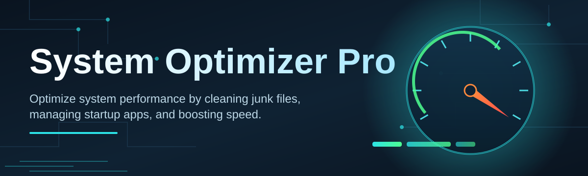

# system-optimizer-pro-booster ⚡🛡️

  

*One binary, one click, a noticeably faster Windows box — no subscriptions, no nonsense.*

---

## 🧭 Overview

System Optimizer Pro is a standalone Windows maintenance engine built by a solo developer who got tired of bloated "cleaner" suites that phone home, nag you with upsells, and still leave junk on disk. This tool does the opposite: it ships as a single executable, runs a deterministic optimization pass across your registry, startup chain, disk cache, and background services, and then gets out of your way. There's no daemon idling in your tray eating RAM — it wakes up, does the job, reports back, and exits clean.

The project exists because system optimization software has quietly become a trust problem. Most "pro" tools in this space bundle telemetry, throttle free features behind paywalls, or silently install background agents. `system-optimizer-pro-booster` takes the opposite stance: transparent logging of every change it makes, a full undo ledger, and zero network calls unless you explicitly check for updates. Every optimization pass writes a rollback snapshot before touching anything.

It's built for power users, gamers chasing frame-time consistency, IT technicians provisioning fleets of machines, and anyone running an aging Windows 10/11 install that's accumulated years of startup cruft. If you've ever watched Task Manager and wondered why 40 background processes are fighting for your CPU cycles at boot, this is the tool that answers that question and fixes it.

  

> [!TIP]
> First time here? Skip straight to **⚙️ Three Steps, Zero Friction** below — you don't need to read the whole README to get value out of this tool today.

---

## ⚙️ Three Steps, Zero Friction

1. **Grab the build** — hit the download button above, it routes to the official landing page, never a mirror.

2. **Run it** — no installer wizard, no dependency chain. Double-click, Windows SmartScreen may ask you to confirm, approve it.

3. **Press Optimize** — the default profile is safe for 99% of machines. Watch the live log, sip your coffee, done.

That's the entire onboarding. Everything past this point is detail for people who want to understand *why* it works, not just that it does.

---

## 🔥 What It Actually Does

- **Startup Triage** — scores every startup entry by real boot-time cost (not guesswork), then lets you disable the worst offenders with a single toggle, no digging through `msconfig`.

- **Registry Sanitation** — walks orphaned keys left behind by uninstalled software and clears them safely, with every deletion mirrored into a rollback ledger first.

- **Service Rebalancer** — identifies Windows services set to automatic that your specific hardware doesn't need, and demotes them to manual without breaking OS stability.

- **Disk Reclaim Engine** — sweeps temp caches, old update leftovers, and shadow copies you no longer need, often freeing multiple gigabytes on a first run.

- **Memory Pressure Relief** — trims standby memory lists and working sets of idle processes so foreground apps get priority access to RAM.

- **Network Stack Tuning** — resets TCP/IP parameters that degrade over time from VPN churn, adapter swaps, or driver conflicts, restoring baseline throughput.

- **Boot Timeline Report** — a visual breakdown of exactly what's eating your seconds between power button and usable desktop.

- **Scheduled Maintenance Mode** — optional silent-run scheduling so the optimizer keeps your system tidy weekly without you lifting a finger.

> [!NOTE]
> Every single action listed above is logged to `optimizer-log.txt` in the same folder as the executable. Nothing happens invisibly.

---

## 🖥️ System Requirements

| Requirement | Detail |
|---|---|
| OS | Windows 10 (64-bit) or Windows 11 |
| RAM | 2 GB minimum, 4 GB recommended |
| Disk | 50 MB free for the tool itself |
| Dependencies | **None** — fully standalone, no runtime installs |
| Admin rights | Required for registry and service operations |
| Internet | Not required to run — only for optional update checks |

> [!IMPORTANT]
> This is a native Windows utility. There is no macOS or Linux build, and there are no plans for one — the entire architecture is built around Win32 and registry primitives that simply don't translate.

---

## 🧩 How It Works

The optimizer runs as a linear pipeline rather than a black box. Each stage is isolated, logged, and reversible, which is what lets it make real changes without the anxiety most "one-click fix" tools induce.

1. **Snapshot** — before touching anything, the current registry and service state is captured to a rollback file.

2. **Scan** — a read-only pass builds a full picture of startup items, services, disk junk, and memory pressure.

3. **Score** — every finding is weighted by actual measured impact, not a fixed rulebook, so results are tailored to your machine.

4. **Apply** — approved changes are executed in dependency-safe order, so nothing breaks mid-optimization.

5. **Verify** — a post-run check confirms system stability before marking the pass complete.

> [!TIP]
> Prefer control over automation? Switch to **Manual Review Mode** in Settings to approve each change individually before it's applied.

---

## 🛟 Troubleshooting

<strong>Windows SmartScreen is blocking the executable — is this safe to run?</strong>

Yes. As a small independent project without a paid code-signing certificate yet, SmartScreen flags unrecognized publishers by default. Click "More info" then "Run anyway." The tool is fully open about every action it takes via its log file.

<strong>My PC feels the same after optimizing — what happened?</strong>

Impact depends heavily on how cluttered your system was beforehand. A fresh Windows install will see minimal gains. A five-year-old machine with dozens of legacy startup entries will typically see the biggest boot-time drops.

<strong>Can I undo an optimization pass?</strong>

Yes — every run generates a timestamped rollback snapshot. Open the **History** tab and select **Restore** on any prior session to revert registry and service changes.

<strong>Does this touch my personal files or browser data?</strong>

No. The optimizer strictly targets system-level registry keys, startup entries, services, and OS-generated temp/cache files. It never scans, reads, or modifies personal documents, photos, or browser profiles.

<strong>Will scheduled maintenance mode slow down my PC while it runs?</strong>

Scheduled passes run at idle priority and pause automatically if you're actively gaming or rendering, resuming once the system is idle again.

<strong>I reverted a change and something's still off — now what?</strong>

Open an issue in the repository's Discussions tab with your `optimizer-log.txt` attached. Community maintainers and the core dev actively triage reports.

---

## 🎛️ UI, Themes & Shortcuts

The interface is intentionally sparse — a single-window dashboard, no nested menus, no modal maze.

| Shortcut | Action |
|---|---|
| `Ctrl + R` | Run full optimization pass |
| `Ctrl + Z` | Open rollback / restore history |
| `Ctrl + L` | Jump to live log view |
| `Ctrl + ,` | Open Settings |
| `F5` | Re-scan without applying changes |

- **Themes:** Dark (default), Light, and a high-contrast Slate mode for accessibility.

- **Settings persist** locally in a config file next to the executable — nothing is written to cloud storage.

- **Manual Review Mode** turns the one-click flow into a checklist you approve item by item, for users who want full oversight.

> [!WARNING]
> Running two instances of the optimizer simultaneously against the same registry hive can cause write conflicts. Always let one pass finish before starting another.

  

---

## 🤝 Contributing & Community

This started as a solo project and stays fast-moving because of that, but contributions are genuinely welcome — bug reports, log analyses, and profile tuning suggestions especially.

> Before opening a pull request, please open an issue first describing the change. This keeps the core optimization logic coherent instead of turning into a patchwork of one-off tweaks.

- Found a bug? Open an issue with your `optimizer-log.txt` attached.
- Have an idea for a new optimization module? Start a Discussion thread.
- Want to help with translations or documentation? Fork away — that path doesn't need pre-approval.

---

## 📄 License

Released under the [MIT License](LICENSE), 2026. Use it, fork it, embed it in your own toolkit — just keep the attribution intact.

---

## ⚠️ Disclaimer

System Optimizer Pro modifies operating-system-level settings including the registry, startup configuration, and Windows services. While every change is snapshotted and reversible through the built-in rollback system, you use this tool at your own risk. The maintainers provide no warranty of any kind and are not liable for data loss, instability, or downtime resulting from its use. Always maintain independent backups of critical systems before running maintenance software of any kind.

  

